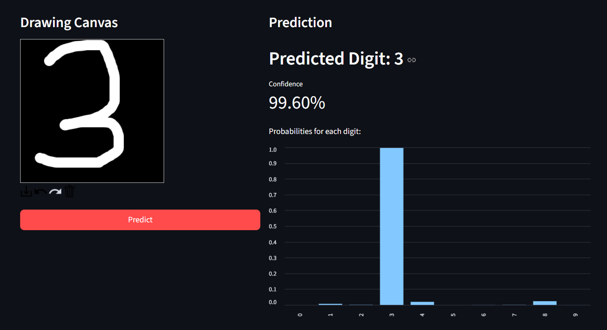
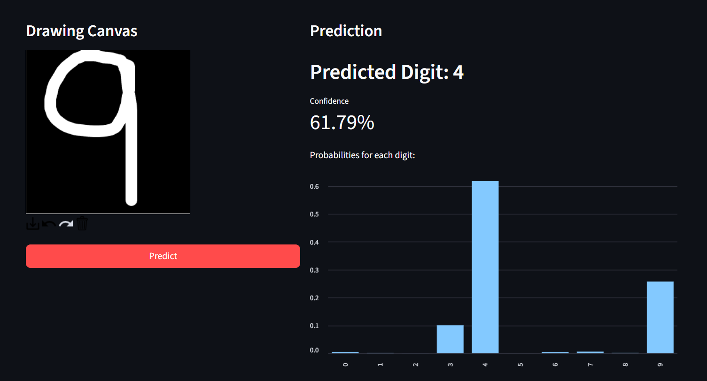
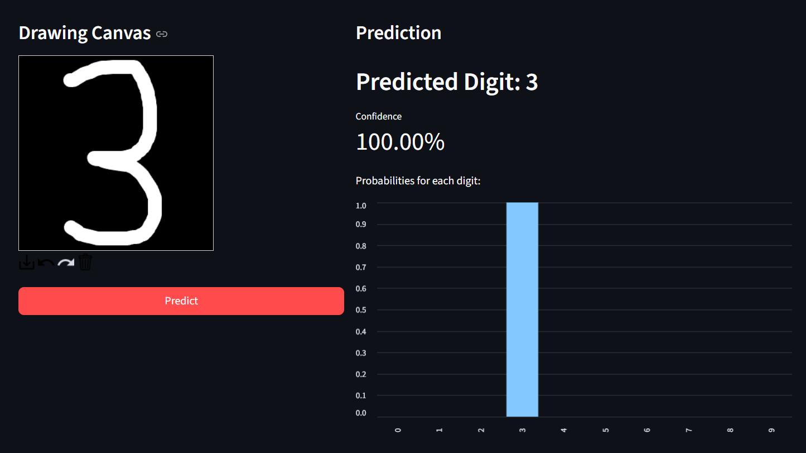
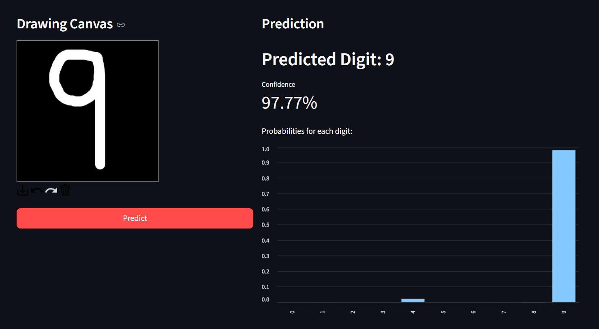

# 🧠 MNIST From Scratch – Sigmoid vs ReLU/Softmax  

A foundational **machine learning project** demonstrating a deep understanding of **neural network mechanics**.  
This code builds **digit recognizers from scratch** using only Python and NumPy — no TensorFlow, PyTorch, or Keras.  

It includes **two neural network implementations**:  
- A **simple Sigmoid network** (educational baseline).  
- A **modern ReLU + Softmax network** (higher accuracy).  

Both models are integrated into a **Streamlit app** where you can **draw digits** and see predictions in real time.  

---

## 🎨 Interactive Streamlit App  

### ✅ Model Comparison Dashboard  

The app provides a **side-by-side comparison** of both neural networks with real-time predictions:

<table align="center" border="1" style="border-collapse: collapse;">
<thead>
<tr>
<th align="center" width="25%"><b>Model Type</b></th>
<th align="center" width="35%"><b>Prediction Example 1</b></th>
<th align="center" width="35%"><b>Prediction Example 2</b></th>
<th align="center" width="5%"><b>Accuracy</b></th>
</tr>
</thead>
<tbody>
<tr>
<td align="center"><b>🔸 Sigmoid<br>Network</b></td>
<td align="center"><br><i>Drawing & prediction interface</i></td>
<td align="center"><br><i>Alternative digit example</i></td>
<td align="center"><b>~95%</b></td>
</tr>
<tr>
<td align="center"><b>🔹 ReLU/Softmax<br>Network</b></td>
<td align="center"><br><i>Drawing & prediction interface</i></td>
<td align="center"><br><i>Alternative digit example</i></td>
<td align="center"><b>~97.5%</b></td>
</tr>
</tbody>
</table>

**Key Interface Features:**
- **Drawing Canvas** – Interactive digit drawing for both models
- **Real-time Predictions** – Instant confidence scores and digit classification  
- **Probability Charts** – Visual confidence distribution for all 10 digits (0-9)
- **Performance Comparison** – See how Sigmoid vs ReLU/Softmax models differ

---

## ✨ Key Features  

- **From Scratch Implementation** – No ML frameworks, just Python + NumPy.  
- **Two Architectures** – Compare a simple Sigmoid NN vs. modern ReLU/Softmax NN.  
- **Object-Oriented Design** – Neural network logic encapsulated in clean classes.  
- **Manual Backpropagation** – Implemented step by step for full transparency.  
- **Smart Initialization** – Xavier/Glorot for stable training.  
- **Interactive App** – Draw digits and get predictions live.  

---

## 🏗 Architectural Comparison  

This project provides a **side-by-side comparison** of a classic and a modern NN architecture, both built **from scratch**.  

### 🔹 Model 1: Simple Sigmoid Network (`script.py`)  

**Architecture**:  
- Input Layer (784 nodes)  
- One Hidden Layer (100 nodes)  
- Output Layer (10 nodes)  
- **Sigmoid** activations  

✅ **Pros**: Easy to understand fundamentals of feedforward/backprop.  
❌ **Cons**: Vanishing gradients, slower learning, ~95% accuracy.  

---

### 🔹 Model 2: ReLU/Softmax Network (`script_relu.py`)  

**Architecture**:  
- Input Layer (784 nodes)  
- Hidden Layer 1 (128 nodes, ReLU)  
- Hidden Layer 2 (64 nodes, ReLU)  
- Output Layer (10 nodes, Softmax)  

✅ **Pros**: Faster training, avoids vanishing gradient, ~97.5% accuracy.  
✅ **Probabilistic output** with confidence scores.  

---

### 📊 Performance at a Glance  

| Feature             | Sigmoid Model | ReLU/Softmax Model |
|---------------------|--------------|--------------------|
| Hidden Layers       | 1            | 2                  |
| Hidden Activations  | Sigmoid      | ReLU               |
| Output Activation   | Sigmoid      | Softmax            |
| Typical Accuracy    | ~95%         | ~97.5%             |
| Training Speed      | Slower       | Faster             |

---

## 📦 Installation & Setup  

### 1. Clone the Repository  

```bash
git clone https://github.com/AryaDuhan/mnist_from_scratch.git
cd mnist_from_scratch
```

### 2. Install Dependencies

```bash
pip install numpy pillow streamlit streamlit-drawable-canvas
```

### 3. Download MNIST Dataset

Download from: 🔗 [Kaggle – MNIST Dataset](https://www.kaggle.com/datasets/hojjatk/mnist-dataset)

Place files in `mnist_data/`:

```
mnist_data/
│── train-images.idx3-ubyte
│── train-labels.idx1-ubyte
│── t10k-images.idx3-ubyte
└── t10k-labels.idx1-ubyte
```

### 4. Train the Models

Train the **Sigmoid model**:

```bash
python script.py
```

Creates: `trained_model.pkl`

Train the **ReLU/Softmax model**:

```bash
python script_relu.py
```

Creates: `trained_model_relu.pkl`

### 5. Run the Streamlit App

Sigmoid model:

```bash
streamlit run app.py
```

ReLU/Softmax model:

```bash
streamlit run app_relu.py
```

---

## 📊 Example Training Output

```bash
Starting training on 60000 images for 3 epochs.
Epoch 1/3
Epoch 2/3
Epoch 3/3
Time: 24.84 seconds
Accuracy: 96.31%
```

---

## 📄 License

This project is licensed under the **MIT License** – see the LICENSE file for details.